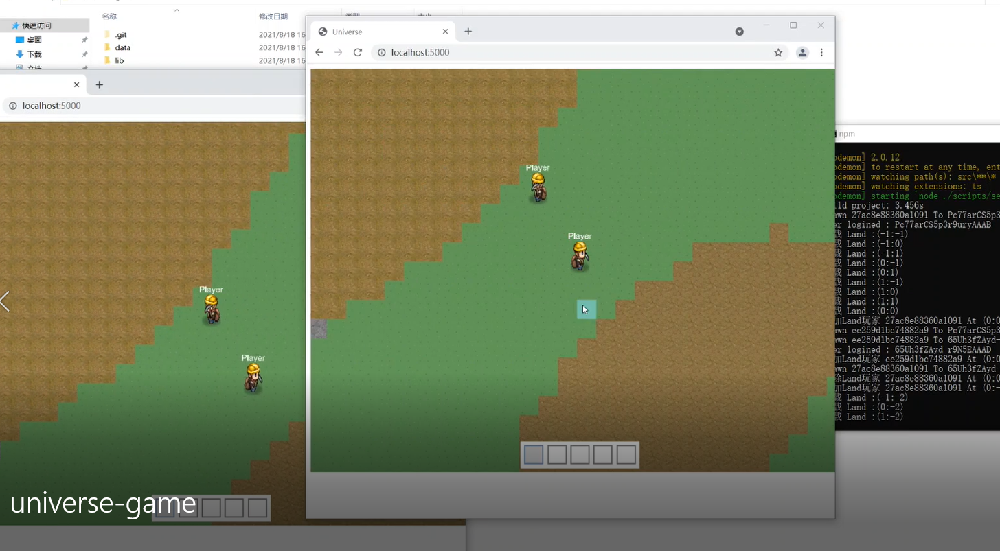

# Universe

## Multi-Player Game

This is a multi-player HTML5 game based on `pixi.js`, `socket.io` and `loki.js` written in TypeScript.



## Project & Game goal

The main target to generate a framework named `uni.js`.

And finish the multi-player, infinity map, 2D sandbox game just like `Minecraft`.

## State Synchronization

The game system use client-side prediction & server reconciliation to implement synchronization of game actors.

This part is completely written in TypeScript, and it performs well.

reference: <https://www.gabrielgambetta.com/client-server-game-architecture.html>

## Start Developing

to start development, following the steps:

clone the repository firstly,

```bash
git clone https://github.com/uni-js/universe
```

and create a `.env` file, in the root of project folder,
to specify data folder of the server and some other options.

```
DB_LOCATION=./data/
```

then run the commands:

```bash
yarn # install the dependencies
yarn start:server # start developing server
yarn start:client # start developing client
```

then visit the client url to play the game under development.

## Contribute

the author keep maintaining this project,

if you are interested in it, the contribution is welcomed.

## LICENSE

The project is under MIT License.